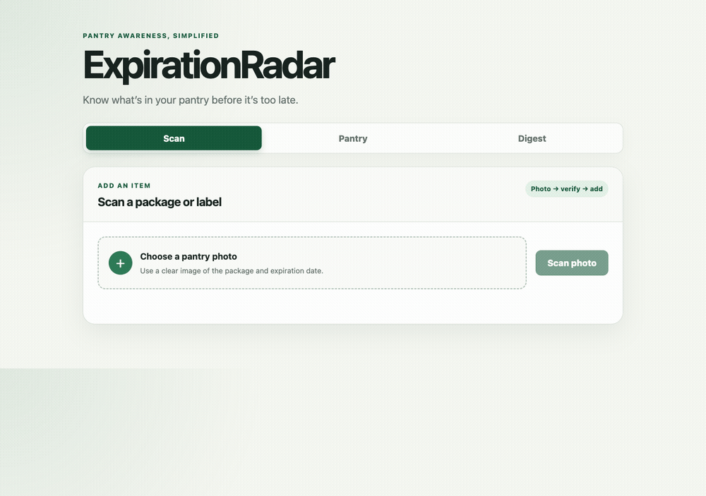

# ExpirationRadar

[](https://github.com/Ps23102004/expirationradar/actions/workflows/tests.yml)

Photo of your pantry in, expiry dates and live FDA recall checks out —
computed on your machine.



## What it actually does

```
pantry photo
  → barcode (pyzbar)         → UPC → Open Food Facts product/brand lookup
  → OCR (tesseract)          → product text + expiry date (deterministic regex parse)
  → vision fallback (Ollama) → only when a date/product is still missing after the above
  → openFDA recall check     → live cross-reference by UPC, then by product/brand terms
  → confirm-edit UI          → every field shows its source + confidence, edit before saving
  → pantry (sqlite)
```

Barcode and OCR are deterministic and always run. Vision is a fallback tier
only — it fills a hole, it never overrides a deterministic read.

## Shipped state: live by default

Unlike most of the sibling apps in this portfolio, ExpirationRadar does **not**
ship on demo data waiting for an API key. Open Food Facts and openFDA's
enforcement API both work with zero configuration and no key — a fresh
`git clone` + `pip install` talks to the real internet on the first scan.

The one piece that needs a manual step is the vision fallback:

```bash
ollama pull qwen3-vl:8b
```

Without it, barcode reads, OCR, dates, pantry, recalls, and the watcher all
work exactly the same — only vision-sourced fields and `/api/recipes` degrade
to a clean "N/A" instead of erroring.

## Install

```bash
python3 -m venv .venv
.venv/bin/pip install -e ~/Developer/llm-ladder   # not on PyPI — install this first
.venv/bin/pip install -e ".[dev]"
.venv/bin/python -m pytest
```

System deps (both via Homebrew): `brew install tesseract zbar`.

The frozen JSON API contract lives in [`docs/API.md`](docs/API.md) — read it
before touching `server.py`, `web/`, or `models.py`.

## CLI usage

```bash
expirationradar scan photo.jpg              # scan a photo, prompts to add results to pantry
expirationradar scan photo.jpg --json --yes  # machine-readable, adds every candidate with no prompt

expirationradar pantry list                  # active items, soonest expiry first
expirationradar pantry list --all --json     # include consumed items, as JSON
expirationradar pantry add "Eggs, dozen" --expiry 2026-09-01
expirationradar pantry consume 3             # mark item 3 consumed (kept, not deleted)
expirationradar pantry rm 3                  # hard-delete item 3

expirationradar recalls                      # re-check every active item against openFDA now

expirationradar digest --days 5              # expiring-soon summary from the last watcher run

expirationradar recipes --days 5             # use-it-up suggestions for items expiring soon

expirationradar export --days 5              # markdown shopping list to stdout

expirationradar watch                        # one autonomous pass, then exit
expirationradar watch --install              # daily 08:30 launchd job
expirationradar watch --uninstall            # remove the launchd job

expirationradar serve --port 8000            # local web UI + API on 127.0.0.1
```

## Web UI

`expirationradar serve` then open `http://127.0.0.1:8000`. Three views:

- **Scan** — upload a photo, get back candidates with per-field provenance
  badges (`BARCODE` / `OCR` / `VISION` / `USER`) and confidence, edit any
  field inline, then confirm to add to the pantry.
- **Pantry** — every active item, soonest expiry first, with Consume/Delete
  actions and a Recipes panel of use-it-up suggestions for what's expiring.
- **Digest** — the same summary the watcher writes to disk: new recalls,
  expired items, and items expiring soon.

## Autonomous watcher

`expirationradar watch --install` writes and loads a daily 08:30
`~/Library/LaunchAgents/com.parth.expirationradar.plist`; `--uninstall`
reverses it. Each pass:

1. Re-checks every active pantry item against openFDA — a recall only counts
   as new if its `recall_number` hasn't been seen before, so an alert fires
   exactly once.
2. Checks for expiry-threshold crossings and anything now past its date.

Results write to sqlite plus `~/.expirationradar/last_digest.json`, and
surface three ways: a best-effort macOS notification when something's new,
`expirationradar digest`, and the web UI's Digest view — all three read the
same file. Network down or Ollama off never crashes the scheduled job; it
just runs the parts that don't need them.
